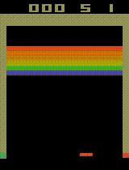
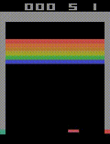
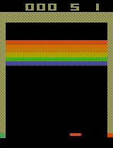

# Breakout DQN Agent

An implementation of a Deep Q-Network (DQN) agent that learns to play Atari Breakout using reinforcement learning.

This project uses PyTorch and the Gymnasium environment to train an agent with experience replay, target network stabilization, and an epsilon-greedy exploration strategy.

## Training Results

## Enviroment

- Observation Space: RGB frames (210×160×3), preprocessed to grayscale 84×84 and stacked 4 times to capture motion.
- Action Space: 4 discrete actions (NOOP, FIRE, RIGHT, LEFT)
- Reward Structure: +1 for breaking a brick, 0 otherwise
- Terminal States: When the player loses all lives or clears all bricks

## Architecture

I implemented a convolutional neural network based on the original DQN paper with three convolutional layers followed by two fully connected layers.

1. Conv layer: 32 filters of size 8×8 with stride 4, ReLU activation
2. Conv layer: 64 filters of size 4×4 with stride 2, ReLU activation
3. Conv layer: 64 filters of size 3×3 with stride 1, ReLU activation
4. Fully connected: 512 neurons, ReLU activation
5. Output layer: 4 neurons (one for each action)

## Demo

| Episode 1 | Episode 2 | Episode 3 | 
|-----------|-----------|-----------|
|  |  |  | 

| Episode 4 | Episode 5 |
|-----------|-----------|
|  |  |

## Results

The agent was successfully trained to play Breakout, showing noticeable improvement over time. The training metrics showed:

- Reward Progression: Starting from random play with scores of 0-1, the agent eventually achieved consistent scores of 10-20 points by the end of training.
- Learning Stability: Loss values initially fluctuated widely but stabilized as training progressed, indicating successful learning.
- Action Distribution: The trained agent learned to use a semi-reasonable distribution of actions, predominantly using LEFT and RIGHT movements to sporadically track the general position of the ball, with occasional FIRE actions to start new rounds. 

When analyzing gameplay recordings, I observed that the agent developed several interesting behaviors:

It learned to position the paddle near the ball
It sometimes defaulted to specific positions, such as the corners, that seemed to maximize its chances of catching rebounds
It struggled with precise movement, especially when the ball came close to the paddle

## Iteration

Through several iterations, I made the following improvements:

- Architecture Adjustments: Started with a simplified network but found the full DQN architecture performed better
- Hyperparameter Tuning: Experimented with different learning rates, epsilon decay schedules, and memory sizes
- Environment Configuration: Tested with and without terminal_on_life_loss, finding that setting this to False allowed the agent to learn more reliable strategies

The most significant improvement came from ensuring dimensional consistency throughout the pipeline and properly implementing the replay memory system.

## Reflections

The most interesting aspect was observing how the agent learned to position the paddle under the ball without explicit instructions, but became increasingly sporadic as the ball came close.

## Conclusion

This project implimented a Deep Q-Network agent to learn and play Breakouto on the Atari using pixel input. The goal was to evaluate the effctiveness of DQN in a classic reinforcement learning setting and understand the impact of various components like frame stacking, replay buffers, and epsilon-greedy exploration.

Throughout training, the agent showed a clear learning curve—with noticeable improvements around 450 and 750 episodes. While the resulting model likely performs worse than any manual strategy, the main takeaway is how quickly reinforcement learning can develop adaptive behavior with relatively minimal domain knowledge.

I suspect the sporadic movement is partially caused by the ball and paddle pixels blending together in preprocessing. This would mean that a successful model would have to learn to position the paddle predictively with earlier ball movements, causing slow convergence.

For future improvements, separating the frames into an upper and lower region might have allowed the model to learn more strategic game play faster since the relevant information is more explicitly provided. This could potentially be a good middle ground between using raw pixel data and full entity extraction.
